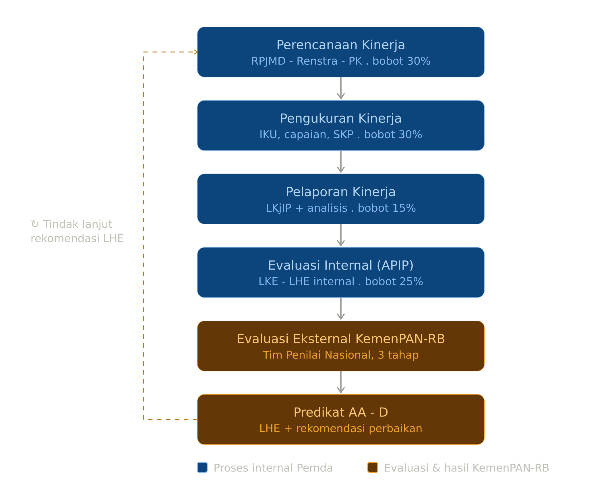

# SAKIP Skill Suite

 

  
  
  

  
  
  
  

Satu paket skill yang saling berkolaborasi untuk mengoptimalkan dokumen Sistem Akuntabilitas Kinerja Instansi Pemerintah (SAKIP) secara berkelanjutan hingga mencapai predikat AA.

## Daftar Skill

1. **sakip-orkestrator**: Hub utama yang memegang peta siklus SAKIP, kontrak data bersama (Dosir Kinerja), referensi regulasi, dan rubrik penilaian LKE. Merutekan tugas ke skill lain.

2. **sakip-perencana**: Spesialis komponen Perencanaan Kinerja (bobot 30%). Membangun pohon kinerja, memperbaiki rumusan indikator (IKU/IKK), dan memastikan keselarasan dokumen perencanaan (RPJMD, Renstra, Renja, PK).

3. **sakip-pelaporan**: Spesialis Pengukuran Kinerja (bobot 30%) dan Pelaporan Kinerja (15%). Menyusun kerangka pengukuran, memperkuat analisis dalam LKjIP, dan menjadikan laporan kinerja sebagai bahan pengambilan keputusan.

4. **sakip-evaluator**: Mesin penilai AKIP berbasis PermenPAN-RB 88/2021 dan lensa Tim Penilai Nasional. Mensimulasikan skor LKE per komponen, memprediksi predikat, dan menemukan gap prioritas yang menghambat kenaikan nilai beserta estimasi poinnya.

5. **sakip-improver**: Penggerak loop perbaikan. Mengubah daftar gap dan rekomendasi LHE menjadi rencana aksi terukur dan tersekuens untuk mengejar target predikat. Memicu siklus perbaikan lewat perencana & pelaporan.

  

## Mekanisme Kolaborasi

Skill suite ini dirancang agar setiap bagian dapat bekerja sama melalui satu **kontrak data bersama** berformat JSON, dinamakan **Dosir Kinerja**. Dosir ini dipegang oleh `sakip-orkestrator` sebagai hub, sementara skill lainnya membaca dan menulis ke bagian spesifik sesuai perannya.

Contoh alur kerja menuju predikat AA:

1. `sakip-evaluator` memotret posisi AKIP saat ini dan menghasilkan daftar gap prioritas beserta estimasi poin yang dibutuhkan untuk naik tingkat. Hasil ini ditulis ke bagian `evaluasi` pada Dosir Kinerja.

2. `sakip-improver` membaca daftar gap tersebut, lalu menyusun rencana aksi perbaikan yang terukur dan tersekuens untuk mengejar target. Rencana aksi ini ditulis ke bagian `perbaikan` pada Dosir.

3. Rencana aksi kemudian diteruskan ke `sakip-perencana` atau `sakip-pelaporan`, tergantung fokus perbaikannya. Kedua skill ini mengeksekusi langkah-langkah perbaikan dan memperbarui bagian `perencanaan`, `pengukuran`, dan `pelaporan` di Dosir.

4. Setelah perbaikan dilakukan, `sakip-evaluator` dijalankan kembali untuk memverifikasi peningkatan nilai AKIP. Hasilnya dibandingkan dengan target dan dicatat di `meta.riwayat` pada Dosir.

5. Langkah 1-4 diulang hingga target predikat tercapai.

Dengan berbagi satu struktur data JSON yang konsisten, kelima skill ini dapat bekerja sama secara efektif dalam siklus perbaikan berkelanjutan.

## Pemasangan

1. Pasang kelima file `.skill` melalui Settings → Capabilities → Skills di aplikasi Claude.

2. Mulai percakapan baru dan sebutkan topik terkait SAKIP, AKIP, predikat AKIP, atau dokumen perencanaan/pelaporan kinerja Pemda. `sakip-orkestrator` akan secara otomatis memandu ke skill yang sesuai.

## Kontribusi

Jika Anda menemukan kesalahan, memiliki saran perbaikan, atau ingin berkontribusi pada pengembangan skill suite ini, jangan ragu untuk membuat issue atau pull request pada repositori ini. Masukan Anda sangat berharga.

Terima kasih telah menggunakan SAKIP Skill Suite!

